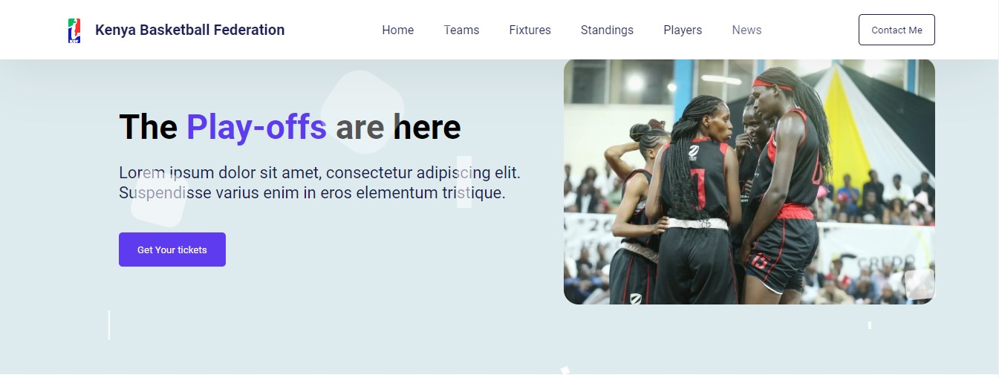

# Personal Portfolio Design #5
In this tutorial , I'm going to show you how to use modern HTML and CSS to create a completely responsive Basketball WebsiteDesign with awesome color theme. We'll be using CSS Flexbox, Media queries for our responsive design and CSS  transition for some cool animation effects. we have a great footer for it! We have a menu with go to div for mobile devices too!

# Screenshot
Here we have project screenshot :

